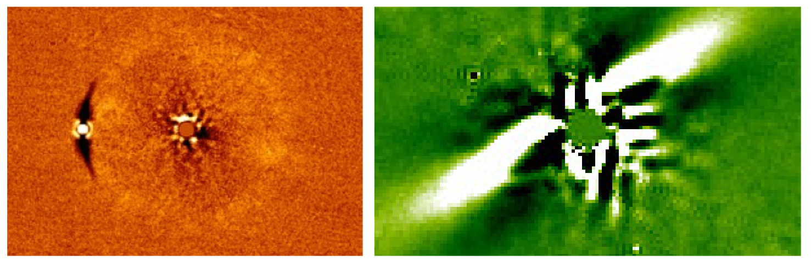

# Hi!

I’m a postdoctoral researcher at MIT, where I use observations with world class telescopes to study the planetary systems of nearby stars.

Most of my research uses high resolution and high contrast adaptive optics imaging. I'm interested in understanding the frequency and properties of exoplanet systems, and in particular the architectures of exoplanet systems, and the interactions of exoplanets with debris disks and companion stars. I've been leading programs to search for long-period exoplanets and brown dwarfs with the [SPHERE](https://www.eso.org/sci/facilities/paranal/instruments/sphere.html) instrument at the [Very Lage Telescopes](https://www.eso.org/public/usa/teles-instr/paranal-observatory/vlt/), and I contributed to a large program searching for planets with the [NIRC2](https://www2.keck.hawaii.edu/inst/nirc2/) instrument at the [Keck Observatory](http://www.keckobservatory.org/). I've also contributed to the [TESS](https://tess.mit.edu/) follow-up program. TESS finds transiting planets, and by searching for faint companions to the planet host I ensure that planet radii are measured correctly and check that the signal really is originating from the star we think.

I completed my PhD in 2018 at the University of Exeter, where I worked with Prof Sasha Hinkley. After writing my thesis I moved across the pond to MIT, where I now work with Prof Ian Crossfield and Prof Sara Seager.

## Email me at [ematth@mit.edu](mailto:ematth@mit.edu)

## See my publications [on ADS](https://ui.adsabs.harvard.edu/search/q=docs(library%2F3q9CQGufQNOelb8sO5DOpg)&sort=date%20desc%2C%20bibcode%20desc&p_=0)

I'm passionate about science communication, and currently co-lead the [Astronomy on Tap Boston](https://www.facebook.com/aotboston/) team - if you're in the area, come along to one of our events! I've also been mentoring high school and undergraduate students through the [JuRA @ MIT](https://clarasousasilva.com/jura) program.

Watch me present my thesis work as part of the [IOP 3 Minute Wonder](https://www.iop.org/activity/3-minute-wonder/page_60438.html#gref) competition below:

<iframe width="500" height="281" src="https://www.youtube.com/embed/UDVLm8WPB8U" frameborder="0" allow="accelerometer; autoplay; encrypted-media; gyroscope; picture-in-picture" allowfullscreen></iframe>