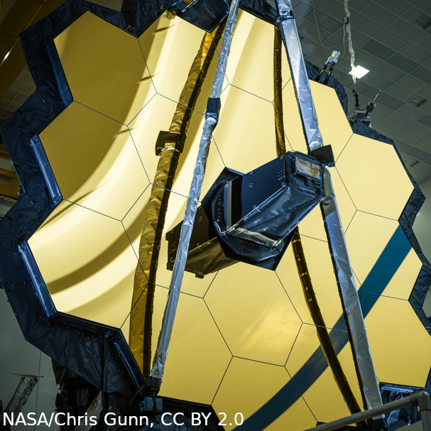

[Home](https://ecmatthews.github.io/) | [Talks and Posters](https://ecmatthews.github.io/slides) | [Media](https://ecmatthews.github.io/media)

 | Detection of three stellar mass companions to highly dusty debris disk systems: my [poster](https://ecmatthews.github.io/exo3poster/exo3_poster.html) from the [Exoplanets III](https://hdconfsys.zah.uni-heidelberg.de/exoplanets3/index.php) conference in Heidelberg (virtually), July 2020.

 | [Overture to Exoplanets](https://eos.org/features/overture-to-exoplanets), an article in *EOS: Science News by AGU* written by Kimberly M. S. Cartier.

 | [Take a Virtual Reality tour of six REAL exoplanets](https://www.youtube.com/watch?v=qhLExhpXX0E), a 360° VR experience produced by [We The Curious](https://www.google.com/search?channel=fs&client=ubuntu&q=we+the+curious) and the [University of Exeter Astrophysics Group](http://emps.exeter.ac.uk/physics-astronomy/)

<!---
[Geneva programmes for JWST](https://www.unige.ch/sciences/astro/en/news/programmes-jwst/)
-->