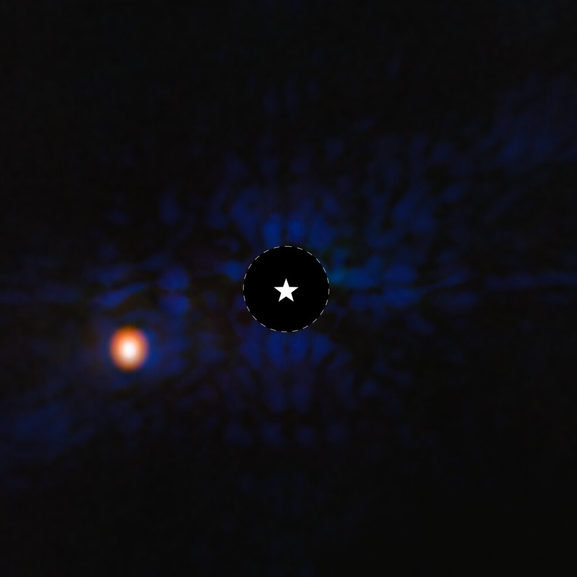

[Home](index) &emsp; &emsp; [Research](research) &emsp; &emsp; [Outreach](outreach) &emsp; &emsp; [Media](media)
&emsp;

Here are some links to selected media coverage of my results, and press appearances, videos and articles that I've written.

I'm always happy to speak to journalists about my science, and about exoplanets and astrophysics more broadly, and I can take media requests in both English and German. Get in touch at [matthews@mpia.de](mailto:matthews@mpia.de).

<!---
using a hack to set relative column spacings: blank space headers that force a width on the RH column.
-->

| &nbsp; | &emsp; &emsp; &emsp; &emsp; &emsp; &emsp; &emsp; &emsp; &emsp; &emsp; &emsp; &emsp; &emsp; &emsp; &emsp;  |
| --- | --- |
|   | My recent paper presenting a cold exoplanet imaged with JWST ([Matthews et al. 2024]()) received significant press coverage, including in [Scientific American](https://www.scientificamerican.com/article/jwst-images-freezing-giant-exoplanet-12-light-years-away/) the [BBC Sky at Night Magazine](https://www.skyatnightmagazine.com/news/webb-epsilon-indi-ab), and the [Associated Press](https://apnews.com/article/super-jupiter-nasa-webb-space-telescope-010a1f304adb196270f79f0e3c7cb592).  |
|  | I contributed to writing and narration for [Take a Virtual Reality tour of six REAL exoplanets](https://www.youtube.com/watch?v=qhLExhpXX0E), a 360° VR experience produced by [We The Curious](https://www.google.com/search?channel=fs&client=ubuntu&q=we+the+curious) and the [University of Exeter Astrophysics Group](http://emps.exeter.ac.uk/physics-astronomy/). |
|  | I was interviewed for [Overture to Exoplanets](https://eos.org/features/overture-to-exoplanets), an article in *Eos: Science News by AGU* about the planned JWST exoplanet science in cycle 1, written by Kimberly M. S. Cartier. |
|  | [Worlds Premiere: Will JWST Reveal Earth 2.0?](https://www.youtube.com/watch?v=VPT7qvfSVQw&t=1776s) I was a panellist for a webinar discussing JWST exoplanet science, coordinated by *Eos* and hosted by Paul M. Sutter. |
|  | I gave a webinar for the [National Space Academy Takeover](https://www.youtube.com/watch?v=FpnAVR7q0Fg) with the [National Space Centre](https://spacecentre.co.uk/) in the UK. This webinar was part of a series of events talking to professionals in the Space Sector about their work, and their career path in the sector. |
|  | I was a regular author at [astrobites](https://astrobites.org/) during 2016 and 2017, and you can find all my pieces [here](https://astrobites.org/author/ematthews/). |

<!---
[Geneva programmes for JWST](https://www.unige.ch/sciences/astro/en/news/programmes-jwst/)
-->

