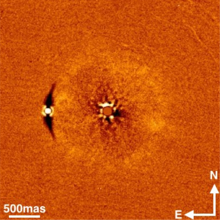

[Home](https://ecmatthews.github.io/) [Talks and Posters](https://ecmatthews.github.io/slides) [Media](https://ecmatthews.github.io/media)

Below is a (very incomplete!) collection of my conference/seminar slides and posters.

image! 

This is: Detection of three stellar mass companions to highly dusty debris disk systems: my [poster](https://ecmatthews.github.io/exo3poster/exo3_poster.html) from the [Exoplanets III](https://hdconfsys.zah.uni-heidelberg.de/exoplanets3/index.php) conference in Heidelberg (virtually), July 2020.

 Detection of three stellar mass companions to highly dusty debris disk systems: my [poster](https://ecmatthews.github.io/exo3poster/exo3_poster.html) from the [Exoplanets III](https://hdconfsys.zah.uni-heidelberg.de/exoplanets3/index.php) conference in Heidelberg (virtually), July 2020.

