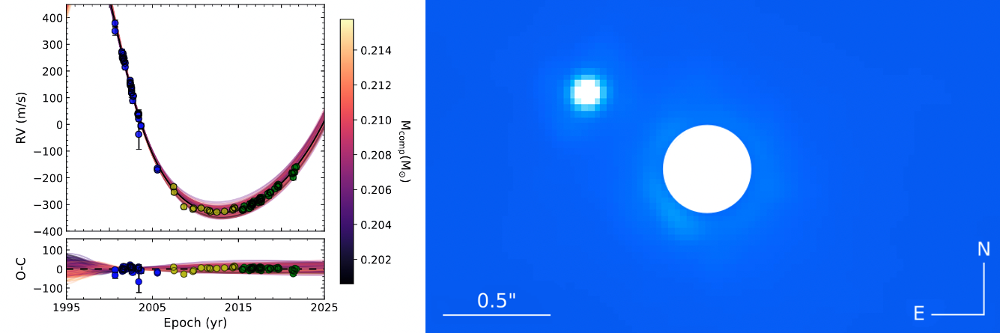
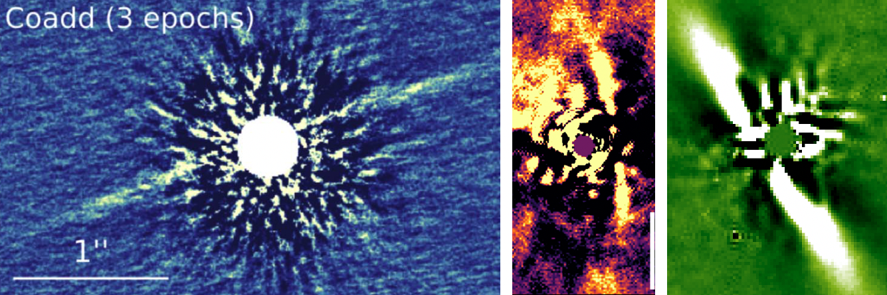
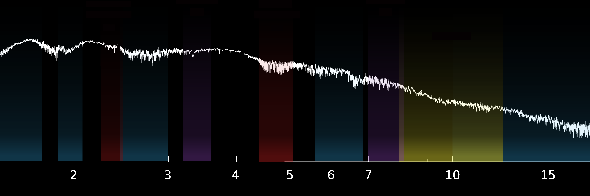

[Home](index) &emsp; &emsp; [Research](research) &emsp; &emsp; [Outreach](outreach) &emsp; &emsp; [Media](media)
&emsp;

Listed below are a few of my current research projects. See my full publication list [on ADS](https://ui.adsabs.harvard.edu/public-libraries/3q9CQGufQNOelb8sO5DOpg).

Did you know JWST programs are citeable? If you use my data, please consider citing [my programs](https://ui.adsabs.harvard.edu/public-libraries/xFQUETUSR_-PVw69WskaFQ).

<!---

IMAGE CREDITS !!!
-->

---

**Imaging cold exoplanets:** The thermal emission of cold exoplanets is directly accessible for the first time with JWST. By targetting systems with long-term accelerations (through radial velocity measurements and/or astrometric measurements), we can hunt out the best systems for this work, and identify new, cold exoplanets that are prime for atmospheric characterization. We can also precisely measure the dynamical masses of these companion, and thereby test thermal evolution models for exoplanets out to solar system ages. I am leading JWST programs ([GO 2243](https://www.stsci.edu/cgi-bin/get-proposal-info?id=2243&observatory=JWST&pi=1) and [GO 5229](https://www.stsci.edu/cgi-bin/get-proposal-info?id=5229&observatory=JWST&pi=1)) to collect coronagraphic imaging of some of the most promising nearby stars that show accelerations, with the goal of directly detecting their exoplanets.

---

*caption to the figure*

**Calibrating evolution of stellar and substellar companions:** We can use this same direct+indirect technique to detect more massive brown dwarfs and low-mass stellar companions from the ground. This is crucial to test theoretical thermal evolution models for substellar companions, via combining dynamical masses with photometric measurements of the companions. There are hints that these "benchmark" brown dwarfs are not always consistent with theoretical models, necessitating further studies to understand the source of this discrepancy for underluminous companions, and to expand the sample of companions and search for trends relative to the theoretical models. Using CORALIE RVs, astrometric accelerations, and SPHERE high-contrast imaging we successfully detected several new brown dwarfs and low-mass stars ([Rickman, Matthews et al. 2022](https://ui.adsabs.harvard.edu/abs/2022A%26A...668A.140R/abstract), [Rickman, Ceva, Matthews et al. 2024](https://ui.adsabs.harvard.edu/abs/2024A%26A...684A..88R/abstract)) and are also working on characterizing the properties of these newly detected companions to compare to atmospheric and evolutionary models. We are also continuing to search for new companions through my SPHERE program [0111.C-2054](http://archive.eso.org/wdb/wdb/eso/approved_runs/query?tel=UT3&prog_id=111.24YA.001&period=111&remarks=%20).  We also used similar methods to study the stellar binary companion to Kepler-444b, which hosts several small planets, and understand the impact of binarity on the stability of this system ([Stalport, Matthews et al. 2022](https://ui.adsabs.harvard.edu/abs/2022A%26A...667A.128S/abstract)).

<!---
---

**Atmospheric studies with JWST spectroscopy:** Once we've detected these objects, we also want to characterize them! Free-floating brown dwarfs provide excellent analogs to giant exoplanet atmospheres, without some of the complications of having to remove light from a nearby star. I'm working with the MIRI Exoplanet GTO team to characterize cold nearby brown dwarfs, and will soon be leading a program to collect spectroscopy of the benchmark brown dwarf binary Eps Ind BA/BB over its full luminous range through JWST program [GO 5765](https://www.stsci.edu/cgi-bin/get-proposal-info?id=5765&observatory=JWST&pi=1).
-->

<!---
---

**Planet-disk interactions:** Much of my work has focussed on understanding the link between giant planets and debris disks. In the solar system, our four gas- and ice- giants are sandwiched between two planetesimal belts (the Asteroid and Kuiper belts). This multi-belt debris disk structure is commonly seen in other systems, begging the question of whether these multi-belt debris disk systems are also home to one more giant planets. We presented a theoretical study of the relationship between planets and multi-belt disks in [Shannon, Bonsor, Kral & Matthews 2016](https://ui.adsabs.harvard.edu/abs/2016MNRAS.462L.116S/abstract), and I then searched for planets in some promising disk systems in [Matthews et al. 2018](https://ui.adsabs.harvard.edu/abs/2018MNRAS.480.2757M/abstract) and [Matthews et al. 2021](https://ui.adsabs.harvard.edu/abs/2021AJ....161...78M/abstract) using the VLT/SPHERE instrument (including data from my programs [097.C-1019](http://archive.eso.org/wdb/wdb/eso/approved_runs/query?tel=UT3&prog_id=097.C-1019(A)&period=97&remarks=%20) and [099.C-0734](http://archive.eso.org/wdb/wdb/eso/approved_runs/query?tel=UT3&prog_id=099.C-0734(A)&period=99&remarks=%20)). While we didn't detect any new planets in these works, we were able to place tight constraints on the possible parameter space for disk-carving giant planets in these systems. We also detected three new stellar binaries, and inferred that the binary companions might be responsible for exciting the planetesimals and generating high volumes of debris dust in these systems.
-->

---

**Debris disk characterization:** Sometimes, when searching for planets in debris disks systems, we are able to detect and characterize the disks themselves in scattered light: starlight reflecting off the micron-sized dust grains that are generated by the collisions of larger planetesimal bodies. This allows us to constrain the geometry of the disks -- possibly hinting towards the location of hidden planets in the disk -- and can also allow the compositions of these grain particles to be studied. I collected the first scattered light images of HD129590 ([Matthews et al. 2017](https://ui.adsabs.harvard.edu/abs/2017ApJ...843L..12M/abstract)) and HD112810 ([Matthews et al. 2023](https://ui.adsabs.harvard.edu/abs/2023A%26A...679A..58M/abstract)) through my VLT/SPHERE high-contrast imaging programs, and modelled the Keck/NIRC2 scattered light images of BD+45° 598 ([Hinkley, Matthews et al. 2021](https://ui.adsabs.harvard.edu/abs/2021ApJ...912..115H/abstract)). I also contributed to the discovery of four new scattered light disks with GPI ([Hom et al. 2022](https://ui.adsabs.harvard.edu/abs/2020AJ....159...31H/abstract)).

<!---
---

**The ISPY program:** I am a member of the NACO-ISPY (Imaging Survey for Planets around Young stars) program, a large program to "spy" planets in nearby protoplanetary & debris disks using NACO L' high-contrast imaging. A highlight of this work was a large study of 178 debris disks, to make predictions about the giant planets that are believed to be shaping these disks ([Pearce et al. 2022](https://ui.adsabs.harvard.edu/abs/2022A%26A...659A.135P/abstract)). Several of these targets are scheduled for JWST observations to search for those giant planets, including the remarkably eccentric HD53143 debris disk [Pearce & Matthews et al. program GO 3973](https://www.stsci.edu/cgi-bin/get-proposal-info?id=3973&observatory=JWST&pi=1). We also looked at the demographics of forming protoplanets, and the impact of extinction on the detectability of these objects [Cugno et al. 2023](https://ui.adsabs.harvard.edu/abs/2023A%26A...669A.145C/abstract).
-->

---

**JWST early release science:** I contributed to a community "early release science" program to test out the high-contrast imaging capabilities of JWST ([GO 1386](https://www.stsci.edu/jwst/science-execution/approved-programs/dd-ers/program-1386)). For this project we explored the coronagraphic capabilities of JWST in [Carter et al. 2023](https://ui.adsabs.harvard.edu/abs/2023ApJ...951L..20C/abstract), the spectroscopic capabilities in [Miles et al. 2023](https://ui.adsabs.harvard.edu/abs/2023ApJ...946L...6M/abstract) and the super-resolution aperture masking interferometry capabilities in [Sallum et al. 2024](https://ui.adsabs.harvard.edu/abs/2024ApJ...963L...2S/abstract) and [Ray et al. 2023](https://ui.adsabs.harvard.edu/abs/2023arXiv231011508R/abstract). We also presented some modelling of the spectroscopic measurements in [Petrus et al. 2024](https://ui.adsabs.harvard.edu/abs/2024ApJ...966L..11P/abstract), and we have more data analysis and modelling work still in the pipeline: watch this space! In [Hinkley et al. 2022](https://ui.adsabs.harvard.edu/abs/2022PASP..134i5003H/abstract) we provide an overview of the program, and in [Hinkley et al. 2023](https://arxiv.org/abs/2301.07199) we provide a "living document" with community recommendations and best-practices for designing high-contrast imaging observations with JWST.

<!---
---

**Confirming Transiting Exoplanets:** As part of the TESS follow-up team, I worked to confirm and validate many transiting planets. My contribution was high-resolution imaging of candidate planet systems: detecting any binary companion stars or background objects is crucial to confirm that a planet is not a false positive (e.g. a background eclipsing binary), and to ensure transitting planet radii are measured accurately and are not biased by additional flux from companion stars in the telescope aperture. For this followup work I led a program with VLT/NACO (program [0103.C-449](http://archive.eso.org/wdb/wdb/eso/approved_runs/query?tel=UT1&prog_id=0103.C-0449(A)&period=103&remarks=%20)) and contributed to a [Gemini large program](https://www.gemini.edu/observing/phase-i/llp/approved-llps/validating-tess-exoplanet-candidates). These data contributed to discovery efforts for several exciting planet discoveries, e.g. [Dragomir et al. 2019](https://ui.adsabs.harvard.edu/abs/2019ApJ...875L...7D/abstract), [Kostov et al. 2019](https://ui.adsabs.harvard.edu/abs/2019AJ....158...32K/abstract), [Günther et al. 2019](https://ui.adsabs.harvard.edu/abs/2019NatAs...3.1099G/abstract), [Burt et al. 2020](https://ui.adsabs.harvard.edu/abs/2020AJ....160..153B/abstract), [Badenas-Agusti et al. 2020](https://ui.adsabs.harvard.edu/abs/2020AJ....160..113B/abstract), [Armstrong et al. 2020](https://ui.adsabs.harvard.edu/abs/2020Natur.583...39A/abstract), [Dransfield et al. 2022](https://ui.adsabs.harvard.edu/abs/2022MNRAS.515.1328D/abstract), [Naponiello et al. 2024](https://ui.adsabs.harvard.edu/abs/2023Natur.622..255N/abstract). I also contributed to larger population studies based on TESS candidate planets, e.g. [Christiansen et al. 2022](https://ui.adsabs.harvard.edu/abs/2022AJ....163..244C/abstract), [Giacalone et al. 2022](https://ui.adsabs.harvard.edu/abs/2022AJ....163...99G/abstract) and [Polanski et al. 2024](https://ui.adsabs.harvard.edu/abs/2024ApJS..272...32P/abstract).
-->

<!---
obs not noted: Keck/NIRC2 2.5 nights. 47/2020B N161; 2019B N113. 
-->