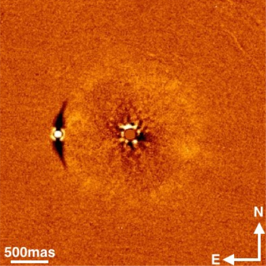

[Home](index) &emsp; &emsp; [Media](media)
&emsp;

&emsp;

Below is a (very incomplete!) collection of my conference/seminar slides and posters that are available online.

| &emsp; | &emsp; &emsp; &emsp; &emsp; &emsp; &emsp; &emsp; &emsp; &emsp; &emsp; &emsp; &emsp; &emsp; &emsp; &emsp;  |
| --- | --- |
|  | Detection of three stellar mass companions to highly dusty debris disk systems: my [poster](https://ecmatthews.github.io/exo3poster/exo3_poster.html) from the [Exoplanets III](https://hdconfsys.zah.uni-heidelberg.de/exoplanets3/index.php) conference in Heidelberg (virtually), July 2020. |